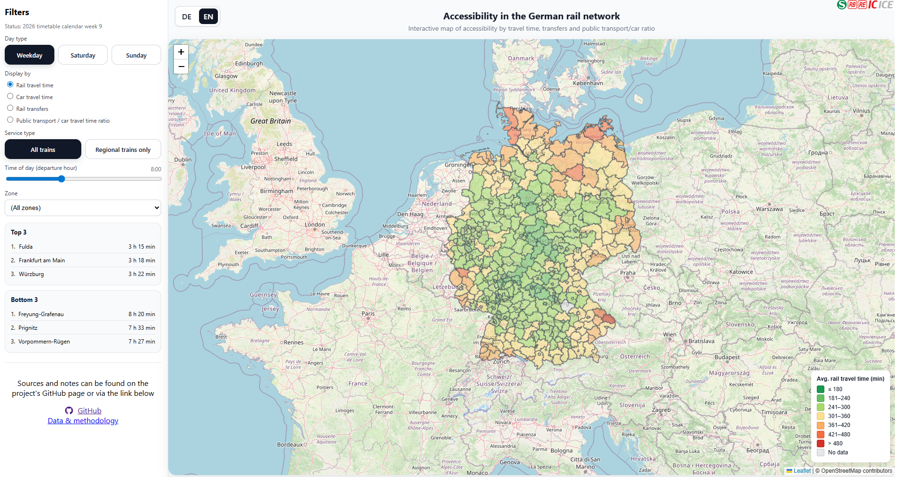

## Deutsche-Bahn Traveltimes

An interactive tool for exploring rail accessibility across Germany.
Using public GTFS timetable data, this project calculates and visualizes travel times, transfers, car travel times, and public-transport-vs-car accessibility ratios on a zone-level interactive map.

Try the web map: https://traveltimes.up.railway.app/

<p align="center">
  
</p>

The project is built around a complete processing and visualization pipeline:

- **GTFS timetable data** is loaded and filtered for the selected service period.
- A **RAPTOR-based routing workflow** computes fast rail connections between representative stops.
- Stop-level results are aggregated to **spatial zones** based on German administrative boundaries.
- A second pipeline computes **car travel times** between the same representative zone points using the openrouteservice matrix API.
- The results are served through a **FastAPI backend** and displayed in an interactive **Leaflet map UI**.

## About the Data and Methodology 

### 1. Public transport data

The project uses GTFS timetable data from https://gtfs.de/ as the basis for rail accessibility analysis. The workflow reads the core GTFS tables, parses service calendars and stop times, and filters the feed for the selected analysis period. The analytical focus is on rail-based regional and long-distance public transport services. The timetable does not include information on local public transportation (subway, tram, etc.) or regional bus service.

### 2. Routing approach

The routing core is based on a RAPTOR-style algorithm. Routing indices are built from GTFS stop times, trips, routes, patterns, and transfers. For each origin stop and departure time, the workflow computes the fastest reachable destinations.

For each origin-destination relation, the best connection is selected based on:

- total travel time
- number of transfers
- arrival time as a tie-breaker

### 3. Spatial aggregation

The project does not visualize raw stop-to-stop results directly. Instead, results are aggregated to administrative zones. For each zone, one **representative stop** is selected. In the current implementation, this is the stop with the **highest number of departures** within the selected service day. Routing is then performed between these representative stops, and the resulting values are stored as **zone-to-zone OD tables**. This makes the results spatially comparable and well suited for map-based presentation.

### 4. Zoning system

The project uses the **VG1000** administrative geography dataset as its zone system (https://gdz.bkg.bund.de/index.php/default/verwaltungsgebiete-1-1-000-000-stand-31-12-vg1000-31-12.html).

### 5. Car travel time comparison

To compare public transport performance with individual motorized travel, the project also computes car travel times between the same representative zone points. These travel times are requested from the **openrouteservice matrix API** (https://openrouteservice.org/). The resulting OD values are then used to calculate a public transport / car travel time ratio.

## Reuse and setup

The project is structured so that its individual components can be reused independently or combined into a full accessibility workflow. In practice, this means the repository can serve both as a standalone analysis project and as a reusable starting point for other GTFS-based routing studies.

Reusable components include:

- GTFS loading and filtering
- zone assignment
- representative stop selection
- RAPTOR index building
- RAPTOR query execution
- zone-to-zone OD table generation
- car travel time comparison
- frontend map display

### To Download and install

Clone the repository and create a virtual environment:

```bash
## To Download and install

Clone the repository and create a virtual environment:

git clone https://github.com/tarikels/deutsche-bahn-traveltimes.git
cd deutsche-bahn-traveltimes
python -m venv .venv

# Activate the virtual environment
.venv\Scripts\Activate.ps1

# Install dependencies
pip install -r requirements.txt
```

### Example Routing Query

For example the routing pipeline can be reused independently. After installing the dependencies, load a GTFS feed, filter it to a service day, build the RAPTOR indices, and run a query between two stops. The repository exposes this as a small public API via `gtfs_toolbox` and `raptor_core`.

```python
from gtfs_toolbox import load_feed, subset_feed_by_date_window, gtfs_time_to_seconds
from raptor_core import (
    build_raptor_indices,
    prepare_departure_lookup,
    route_by_stop_names,
    reconstruct_connection,
)

feed = load_feed("PATH/TO/YOUR/GTFS", parse_stop_times=True)
day_feed = subset_feed_by_date_window(
    feed,
    start="20260224",
    end="20260224",
)

indices = build_raptor_indices(day_feed, on="20260224")
prepare_departure_lookup(indices)

raptor_routes, dest_ids = route_by_stop_names(
    indices=indices,
    stops_table=day_feed["stops.txt"],
    origin_name="Berlin Hbf",
    destination_name="Leipzig Hbf",
    departure_time="08:00:00",
)

result = reconstruct_connection(
    raptor_routes,
    dest_ids,
    origin_dep_time=gtfs_time_to_seconds("08:00:00"),
)
```

## Please note

- Results depend on the quality of the GTFS source data.
- Accessibility is represented through one selected stop per zone.
- Car travel times are approximations based on routing API output.

## Contributions
Contributions are welcome. Please open a ticket if you want to report a bug, share an idea, or suggest a change.

## License

The source code in this repository is released under the MIT License.

This project also relies on third-party data and services that are **not** covered by the repository license. In particular:

- GTFS timetable data remains subject to the terms and licenses of the original data providers.
- Administrative boundary data (such as VG1000) remains subject to the license terms of the respective source.
- Car travel times were computed using the openrouteservice API and are therefore based on external services and underlying OpenStreetMap-derived data, each subject to their own usage and attribution requirements.

Users of this repository are responsible for checking and complying with the applicable licenses, attribution rules, and usage restrictions of all external datasets and services before reusing the data or derived outputs.

## Disclaimer

This project was developed by Tarik El Salim. It is not affiliated with Deutsche Bahn. All information is provided without warranty and may contain errors.

